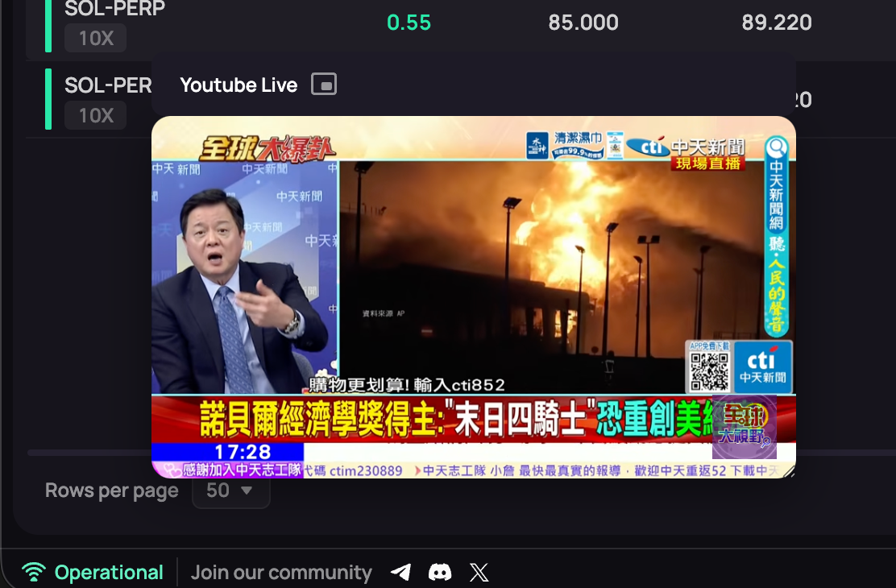

# @orderly.network/youtube-live-plugin

A YouTube Live plugin for the Orderly SDK. Mounts a **draggable floating live-video widget** next to the trading UI, with Picture-in-Picture (PiP), iframe / video display modes, layout persistence, and i18n.


## Features

### YouTube Live Floating Widget

Shows a draggable live-video panel beside the trading view, so traders can watch a YouTube live (or any embedded page / stream URL) without blocking the main trading area. Supports iframe embeds (e.g. YouTube live page) and direct video URLs (e.g. m3u8), with resizable width and height.



### Picture-in-Picture (PiP)

Supports browser-native Picture-in-Picture so users can pop the video out into a small always-on-top window. Optionally, the widget can auto-enter PiP when the tab becomes hidden, making it easier to keep watching while multitasking.


### Multi-language & Layout Persistence

Uses `@orderly.network/i18n` for all user-facing strings and follows the host `LocaleProvider`. The widget can optionally persist its position and size into `localStorage`, restoring the layout after refresh. Works seamlessly with Orderly SDK theming.

## Quick Start

### Installation

```bash
npm install @orderly.network/youtube-live-plugin
# or
pnpm add @orderly.network/youtube-live-plugin
# or
yarn add @orderly.network/youtube-live-plugin
```

### Register the Plugin

```tsx
import { registerOrderlyYoutubeLivePlugin } from "@orderly.network/youtube-live-plugin";

const plugins = [
  registerOrderlyYoutubeLivePlugin({
    src: "https://www.youtube.com/embed/YOUR_VIDEO_ID",
    className: "my-youtube-live", // optional
    displayMode: "iframe", // "iframe" | "video"
    title: "Live", // optional
    defaultWidth: 384,
    defaultHeight: 216,
    autoPipOnVisibilityChange: false,
    persistLayout: true,
    autoPlay: true,
    muted: true,
    controls: true,
  }),
];
```

Pass the `plugins` array to `OrderlyAppProvider`:

```tsx
<OrderlyAppProvider
  plugins={plugins}
  configStore={configStore}
  // ...other props
>
  {children}
</OrderlyAppProvider>
```

### Options

| Option                       | Type                      | Required | Description                                                                                  |
|-----------------------------|---------------------------|----------|----------------------------------------------------------------------------------------------|
| `src`                       | `string`                  | Yes      | Video source URL. For `iframe` mode, an embed URL (e.g. YouTube); for `video` mode, a direct URL (e.g. m3u8). |
| `className`                 | `string`                  | No       | CSS class name for the widget wrapper.                                                       |
| `displayMode`               | `"iframe" | "video"`      | No       | Video display mode. Defaults to `"iframe"`.                                                  |
| `title`                     | `string | ReactNode`       | No       | Optional toolbar title displayed in the widget header.                                       |
| `defaultWidth`              | `number`                  | No       | Default floating width in pixels.                                                            |
| `defaultHeight`             | `number`                  | No       | Default floating height in pixels.                                                           |
| `minWidth`                  | `number`                  | No       | Minimum width in pixels.                                                                     |
| `minHeight`                 | `number`                  | No       | Minimum height in pixels.                                                                    |
| `autoPipOnVisibilityChange` | `boolean`                 | No       | Auto-enter PiP when the tab becomes hidden. Defaults to `false`.                            |
| `persistLayout`             | `boolean`                 | No       | Persist widget position and size in `localStorage`. Defaults to `true`.                      |
| `autoPlay`                  | `boolean`                 | No       | Auto play video (also sets proper query params for iframe mode). Defaults to `true`.         |
| `muted`                     | `boolean`                 | No       | Mute audio (often required for autoplay). Defaults to `true`.                               |
| `controls`                  | `boolean`                 | No       | Show native video controls (only when `displayMode === "video"`). Defaults to `true`.       |

### Peer Dependencies

This plugin requires the following Orderly SDK packages:

- `@orderly.network/hooks`
- `@orderly.network/plugin-core`
- `@orderly.network/i18n`
- `@orderly.network/types`
- `@orderly.network/ui`
- `react` >= 18
- `react-dom` >= 18
